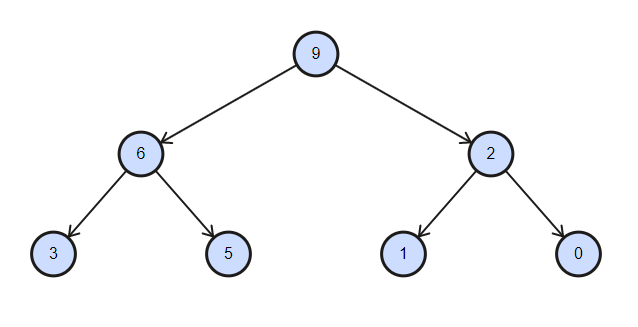
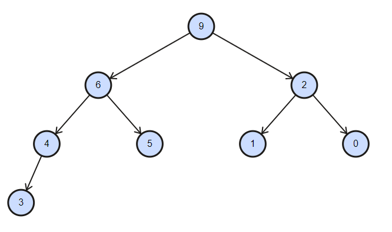
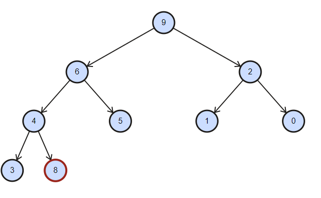
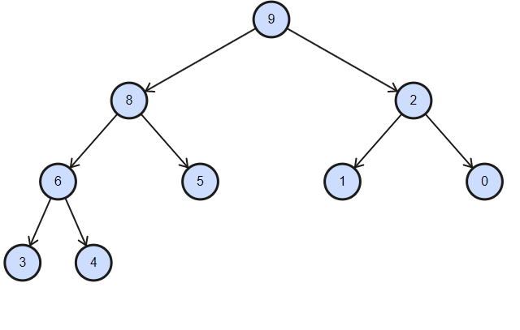

# Heap Binário

Heaps são árvores binárias (com as chaves nos nodos) onde a chave de cada nodo pai não pode ser menor que a chave dos filhos. Esse tipo de heap binário, onde o pai não pode ser menor que o filho é chamada de _maxheap_. 

Para fins de exemplos e implementações usaremos o _maxheap_ (nodo pai maior ou igual aos filhos).

O heap é uma árvore binária completa ou quase completa da esquerda para a direita.

Apesar do heap ser uma árvore binária ele não é igual a árvore binária de pesquisa. Nas árvores de pesquisa os valores maiores são colocados a esquerda do nodo e os maiores a direita. No heap, conforme já mencionado, todos valores filhos não podem ser maior que o pai.

## Propriedades de um heap binário

- Maior chave (valor da árvore) está na raíz da árvore binária, ou seja em a[1]. Acesso ao maior elemento é O(1).
- Árvore binária completa ou quase completa da esquerda para a direita.
- Cada nível da árvore terá que ser completado para que um novo nível seja adicionado.
- Quando todos os níveis estão completos a árvore é completa

### Exemplo 1

Árvore binária completa. 

### Exemplo 2

Árvore binária quase completa

## Representação de heap em array

O heap binário pode ser representado através de um array.

Índices começam com 1. O índice 1 é a raiz da árvore.

Nodos em sequencia por **nível**.

Seja um vetor v[1..m]:

O pai de qualquer índice f é f/2 (exceto o 1 que não tem pai)

O filho esquerdo de um índice p é 2p (filho só existe se 2p <= m)

O filho direito de p é 2p + 1 (filho só existe se 2p + 1 <= m)

### Exemplo 1 em array

| i     | 0    | 1   | 2   | 3   | 4   | 5   | 6   | 7   |
|-------|-----|-----|-----|-----|-----|-----|-----|-----|
| chave | -   | 9   | 6   | 2   | 3  | 5   | 1   | 0   |

### Exemplo 2 em array

| i     | 0    | 1   | 2   | 3   | 4   | 5   | 6   | 7   | 8   |
|-------|-----|-----|-----|-----|-----|-----|-----|-----|-----|
| chave | -   | 9   | 6   | 2   | 4   | 5   | 1   | 0   | 3   |

## Inclusão 

Inclusão feita na primeira posição livre da árvore (array). Seja tail a última posição preenchida do array a inclusão vai sempre na posição tail + 1.

Entretanto após incluir o elemento o heap pode ficar inconsistente. Nesse caso a nova chave deve ir trocando de posição com o pai até chegar em uma situação consistente.

Exemplo: Inserir o valor 8 no heap Exemplo 2

A chave 8 violou o heap. Deve ir trocando com o pai até ajustar. Troca com o 4 e troca com o 6.

Resultado

## Remoção
...

### Implementação

Veja os exemplos em  [código-fonte](ExemploMaxHeap.java).

#### Links adicionais

- Ferramenta para visualizar os heaps: http://btv.melezinek.cz/binary-heap.html.
- https://www.ime.usp.br/~pf/algoritmos/aulas/hpsrt.html
- https://joaoarthurbm.github.io/eda/posts/heap/
- 

